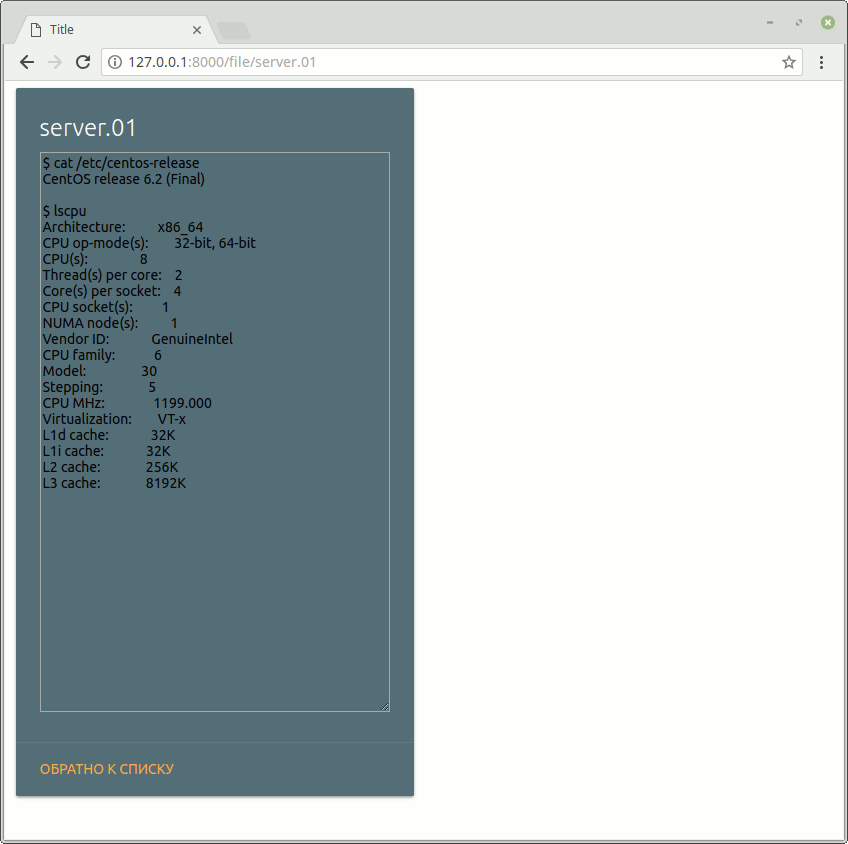

# Работа с менеджером урлов

## Задание

Необходимо в менеджере урлов `app/urls.py`
реализовать схему отображения для трех ситуаций:

* отображение списка файлов
* отображение списка файлов с фильтрацией по дате `/2018-01-01/`
* отображение содержимого отдельных файлов `/file_name.txt`

Для первых двух ситуаций использовать одну функцию для отображения: `app.views.file_list`
Для второй ситуации реализовать конвертер для преобразования даты
`datetime.date` в указанный в задании вид и наоборот.
Для третьей ситуации использовать функцию для отображения: `app.views.file_content`

В функциях `app.views.file_list` и `app.views.file_content`
реализовать логику для формирования контекста.
Директорию, файлы которой нужно отображать, берите из настроек `settings.FILES_PATH`

Для начала ваша задача грамотно привязать вьюхи из `app/views.py`
в схему урлов в `app/urls.py`.
В комментариях написаны названия каждой привязки. Их важно сохранить - по ним будут строиться ссылки в отображаемых документах.

Помните, если view принимает аргумент, то одноименный агрумент должен быть прописан в пути:

```python
def view_func(request, arg1):
    return render(request, 'index.html', context={'arg1': arg1})


urlpatterns = [
    path('', view_func),  # так не срабоатет
    path('<arg1>/', view_func),  # а так сработает
    path('path/<int:arg1>/', view_func),  # и так тоже сработает
]
```

Впрочем для аргумента может быть задано значение по умолчанию:

```python
def view_func(request, arg1=None):
    return render(request, 'index.html', context={'arg1': arg1})


urlpatterns = [
    path('', view_func),  # В таком случае этот вариант сработает и в arg1 будет None
    path('<arg1>/', view_func),  # а в таком случае в arg1 будет приходить строка, указанная в пути
]
```




## Вспомогательная информация

Используйте:

* [os.listdir](https://docs.python.org/3/library/os.html#os.listdir) для получения списка файлов
* [os.stat](https://docs.python.org/3/library/os.html#os.stat) для получения времени изменения и создания файлов в списке файлов

## Документация по проекту

Для запуска проекта необходимо:

Установить зависимости:

```bash
pip install -r requirements.txt
```

Выполнить команду:

```bash
python manage.py runserver
```
