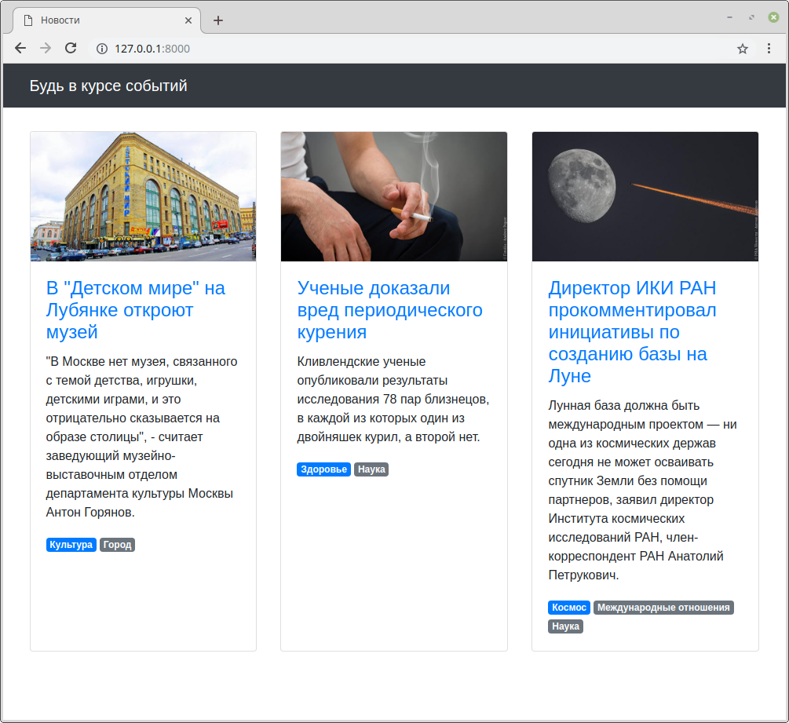
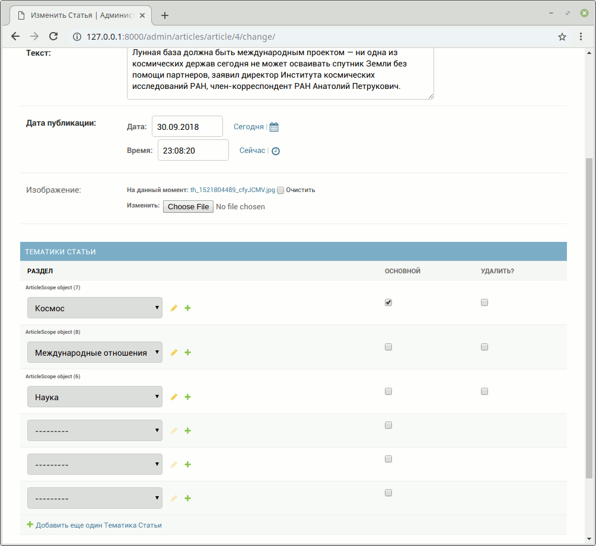

## Задание

Есть небольшой новостной сайт.


Было решено к статьям добавить тематические резделы, к которым они относятся, и отображать их у каждой новости в виде списка тегов.



У каждой статьи может быть несколько разделов, но всегда один из них должен быть основным.
В списке тегов он должен идти первым, потом все остальные в алфавитном порядке.

В админке необходимо реализовать создание разделов
и для страницы _Редактирование статьи_ добавить возможность указывать разделы.
Необходимо так же реализовать проверку на наличие одного и только одного основного раздела.



## Примечание

* `Tag` - просто тег, только его название, ничего более.
* `Article` - статья с текстом, заголовком, картинкой и пр. + набор тегов (многие ко многим)
* `Scope` - таблица связка между статьей и тегом. Именно здесь должно быть свойство `is_main`

---

Вам не надо менять шаблон! Ваша задача реализовать модели и логику так, чтобы текущий шаблон заработал (используйте `related_name`). Для этого внимательно посмотрите на добавленные строки для тегов:

```django

    <span class="badge badge-primarybadge-secondary">{{ scope.tag.name }}</span>

```

## Подсказки

Чтобы реализовать на странице редактирования объекта
возможность редактировать связи через таблицу многие-ко-многим,
в админке используйте свойство `inlines`:

```python
from django.contrib import admin

from .models import Object, Relationship


class RelationshipInline(admin.TabularInline):
    model = Relationship


@admin.register(Object)
class ObjectAdmin(admin.ModelAdmin):
    inlines = [RelationshipInline]
```

Вместо `Object` должна быть модель, имеющая связь многие-ко-многим,
а вместо `Relationship` должна быть модель связи, указанная как `through` для связи (Подробнее: https://docs.djangoproject.com/en/3.1/ref/models/fields/#django.db.models.ManyToManyField.through).
Все остальное django реализует автоматически.

Однако в этой задаче вам потребуется добавить дополнительную проверку при сохранении объекта.
Для этого в объекте Inline'а можно переопределить атрибут `formset`, который должен указывать на специальный класс типа `BaseInlineFormSet`, нужный для обработки списка однотипных форм (каждая для своей связи).
Воспользуйтесь следующим примером с переопределением метода `clean`, указанного в качестве `formset` класса:

```python
from django.contrib import admin
from django.core.exceptions import ValidationError
from django.forms import BaseInlineFormSet

from .models import Object, Relationship


class RelationshipInlineFormset(BaseInlineFormSet):
    def clean(self):
        for form in self.forms:
            # В form.cleaned_data будет словарь с данными
            # каждой отдельной формы, которые вы можете проверить
            form.cleaned_data
            # вызовом исключения ValidationError можно указать админке о наличие ошибки
            # таким образом объект не будет сохранен,
            # а пользователю выведется соответствующее сообщение об ошибке
            raise ValidationError('Тут всегда ошибка')
        return super().clean()  # вызываем базовый код переопределяемого метода


class RelationshipInline(admin.TabularInline):
    model = Relationship
    formset = RelationshipInlineFormset


@admin.register(Object)
class ObjectAdmin(admin.ModelAdmin):
    inlines = [RelationshipInline]
```

Для упорядочивания моделей по умолчанию удобно воспользоваться свойством `Meta` класса `ordering`:

```python
class Article(models.Model):
    ...

    class Meta:
        verbose_name = 'Статья'
        verbose_name_plural = 'Статьи'
        ordering = ['-published_at']
```

## Документация по проекту

Для запуска проекта необходимо:

Установить зависимости:

```bash
pip install -r requirements.txt
```

Провести миграцию:

```bash
python manage.py migrate
```

Загрузить тестовые данные:

```bash
python manage.py loaddata articles.json
```

Запустить отладочный веб-сервер проекта:

```bash
python manage.py runserver
```
