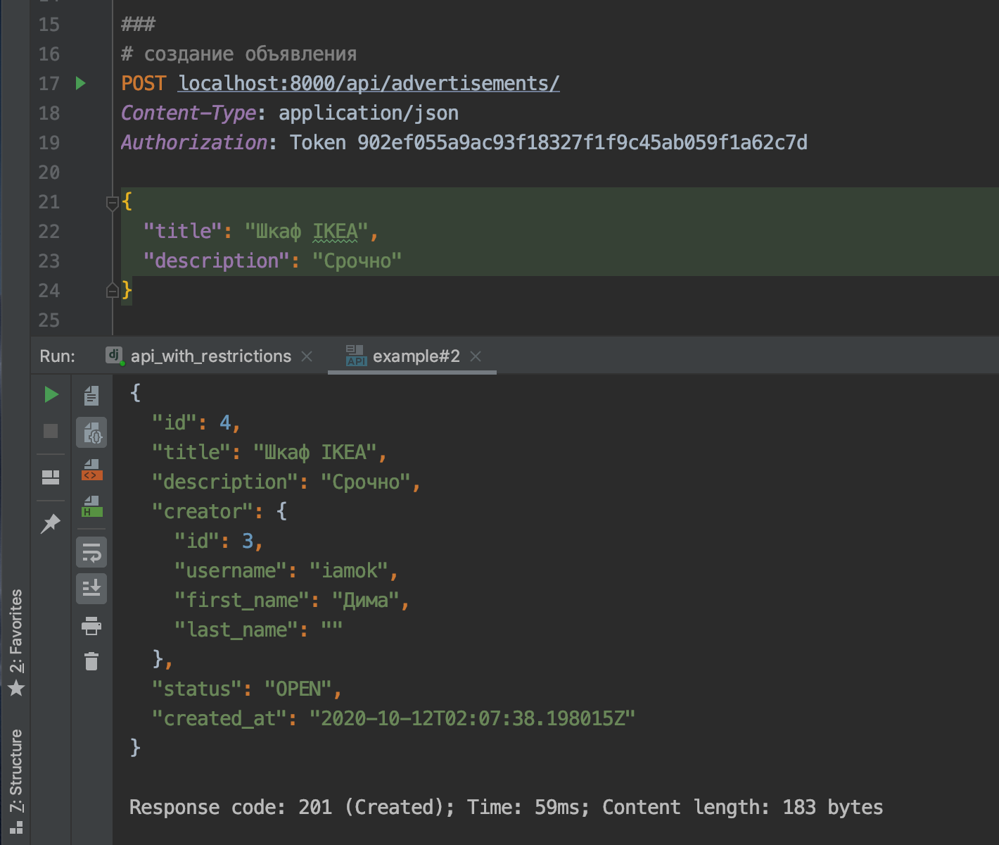
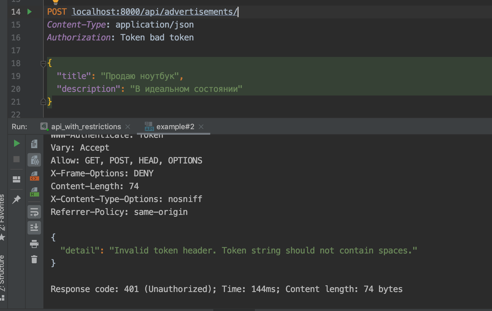

Backend для приложения с объявлениями
======


## Описание

Необходимо реализовать бекенд для мобильного приложения с объявлениями. Объявления можно создавать и просматривать. Есть возможность фильтровать объявления по дате и статусу.

Создавать могут только авторизованные пользователи. Для просмотра объявлений авторизация не нужна.

У объявления есть статусы: `OPEN`, `CLOSED`. Необходимо валидировать, что у пользователя не больше 10 открытых объявлений.

Обновлять и удалять объявление может только автор этого объявления.

## Реализация

- используйте `DateFromToRangeFilter` для фильтрации по дате https://django-filter.readthedocs.io/en/master/ref/filters.html

Пример работы:


- В настройках подключено приложение `rest_framework.authtoken` и сконфигурирован `DEFAULT_AUTHENTICATION_CLASSES`. Для того, чтобы завести токен для пользователя, проделайте следующие шаги:

   - создайте пользователя через админку
   - также через админку, заведите ему токен
   - этот токен используйте в запросах, передавая его в заголовках

- Так как интерфейс BrowserableAPI в DRF не позволяет передавать заголовки с токеном, используйте Postman или HTTP-клиент VSCode.

Примеры:

Успешный запрос:


Неправильный токен:


- Для переопределения доступов для отдельных методов `ViewSet` используется метод `get_permissions` (добавлен в заготовку, следует с ним ознакомиться и посмотреть с помощью breakpoint'ов в какой момент DRF его вызывает)

- валидацию удаления чужого объявления следует делать:
   - либо внутри метода `destroy` https://www.django-rest-framework.org/api-guide/viewsets/#viewset-actions (чуть проще)
   - либо определяю дополнительный класс-наследник `BasePermission`, дополнительно добавляя его в список `get_permissions` https://www.django-rest-framework.org/api-guide/permissions/#examples (правильнее и этот класс можно переиспользовать для других методов)
   
   Любой вариант допустим в рамках данного задания.
   
- С примерами запросов к API вы можете ознакомиться в [файле requests-examples.http](./requests-examples.http)

## Подсказки

1. В места, где нужно добавлять код, включены `TODO`-комментарии.

2. Ознакомьтесь целиком со структурой проекта. Разберите, как работает код в заготовке, например, проставляется поле создателя объявления таким образом, чтобы злоумышленник не мог создавать объявления от чужого лица.

3. Используйте возможность указывать `fields` в `Meta` внутри `FilterSet` класса, чтобы не задавать фильтры, которые могут сгенерироваться автоматически.

4. Админка Джанго по-умолчанию даст возможность создания и редактирования пользователей и токенов. Этим удобно пользоваться для локального создания сущностей.


## Доп-задания (не обязательные к выполнению)

### Права для админов

- Реализуйте функциональность для админов. Админы могут менять и удалять любые объявления.

### Избранные объявления

- Добавить возможность добавлять объявления в избранное. Автор объявления не может добавить свое объявление в избранное. Должна быть возможность фильтрации по избранным объявлениям. Например, пользователь хочет посмотреть все объявления, которые он добавил в избранное.

- для того, чтобы добавить дополнительный метод с урлом во ViewSet, вам может пригодиться декоратор `action` из `DRF`.

### Добавить статус `DRAFT`

- добавьте статус `DRAFT` - черновик. Пока объявление в черновике, оно показывается только автору объявления, другим пользователям оно недоступно.


## Документация по проекту

Для запуска проекта необходимо:

Установить зависимости:

```bash
pip install -r requirements.txt
```

Вам необходимо будет создать базу в postgres и прогнать миграции:

```base
manage.py migrate
```

Выполнить команду:

```bash
python manage.py runserver
```
