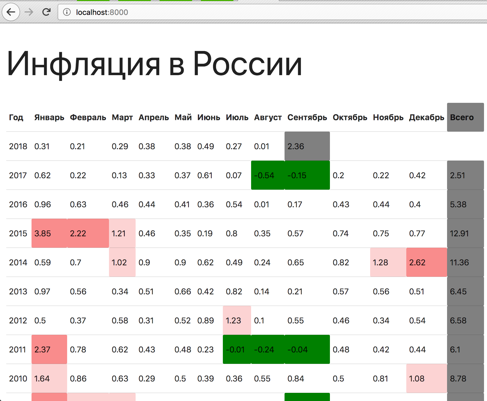
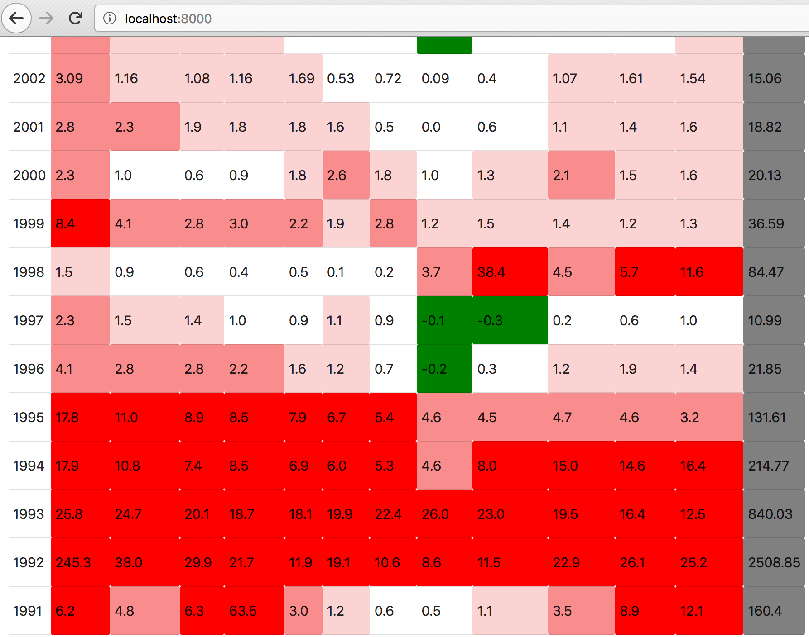

Построение таблицы
=======

Вам необходимо оценить динамику инфляции в РФ и подготовить сравнительную таблицу. У вас есть данные по инфляции в csv-файле, необходимо реализовать приложение, которое выводит размер инфляции по годам и месяцам в процентах и отображает общую инфляцию за год.

Вам необходимо реализовать чтение csv-файла `inflation_russia.csv` во view `InflationView` в файле `apps/views.py` и вывести данные из этого файла в таблице.

Построение шаблона реализуйте в файле `app/templates/inflation.html`.

Таблица должна состоять из столбцов: "Год", перечисление месяцев, "Всего". Суммарно 14 столбцов.

Таблица с суммарной величиной должна быть закрашена в серый цвет.

Если инфляция за месяц была отрицательной (дефляция), то ячейка должна быть закрашена в зеленый. Если инфляция превысила 1%, то в красный. Должна быть реализована визуальная градация красного: от 1% до 2%, от 2% до 5%, от 5% и более (3 оттенка красного, визуально они должны быть различимы).

Если данных за месяц нет, то нужно выводить прочерк.


## Примеры таблицы:

#### Пример 1


#### Пример 2


## Советы

- как работать с csv в Python: https://docs.python.org/3.6/library/csv.html


## Документация по проекту

Для запуска проекта необходимо:

Установить зависимости:

```bash
pip install -r requirements.txt
```

Создать файл с локальными настройками `app/settings_local.py`
и задать туда обязательные параметры:

* SECRET_KEY - секретная строка

Например:

```python
SECRET_KEY = 'd+mw&mscg5i&tx+#@bf+6m%e+d5z!u#!n%z-^o9u7y1felv2o&'
```

Выполнить команду:

```bash
python manage.py runserver
```
