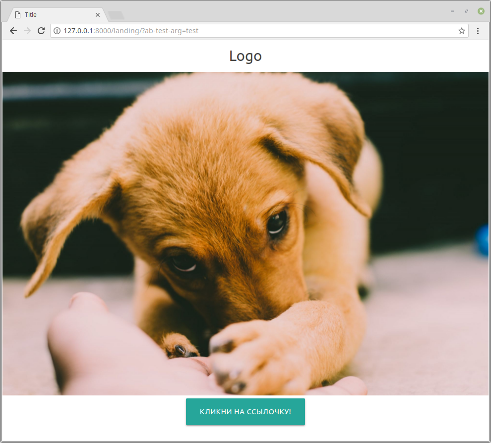
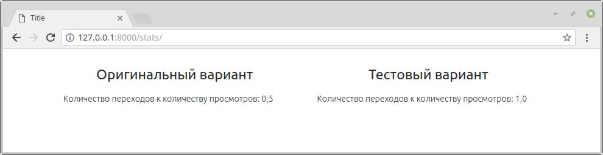

# AB тестирование

## Задание


Для того, чтобы протестировать, какой из дизайнов лендинга привлекает больше клиентов, было решено провести ab-тестирование.

Для этого вам необходимо реализовать различное отображение страницы лендинга в зависимости от GET параметра `ab-test-arg`, который может принимать значения original и test. То есть если `ab-test-arg=original`, вы показываете одну версию страницы. Если `ab-test-arg=test`, вы показываете другую версию страницы.

При переходе пользователя на главную страницу, вы подсчитываете, с какого именно лендинга был совершен переход.

Для анализа эффективности так же реализуйте подсчет отношения показов лендинга к переходам с этого лендинга.

### Как реализовывать

- показываете разные варианты лендинга в зависимости от параметра `ab-test-arg`, увеличиваете счетчик показов `counter_show` для этого лендинга.
- с разных лендингов идет ссылка на главную страницу сайта с разным урл-параметром `from-landing` (уже передается в шаблоне, вам нужно только достать правильный шаблон)
- во view-функции главной страницы сайта вы получаете параметр `from-landing` и увеличиваете счетчик `counter_click`
- во вью `stats` показываете статистику "показы" / "клики" для каждого варианта лендинга  

Куда смотреть:

* в отображении `app.views.landing` реализовать раздельный показ двух разных страниц в зависимости от параметра `ab-test-arg`
  (альтернатинвый вид лендинга находится в шаблоне `landing_alternate.html`)
  и подсчет количества показов разных версий
* в отображении `app.views.index` реализовать подсчет переходов с лендинга
  на основе GET параметра `from-landing` (на каждой из страниц лендинга
  ссылка на главную страниц имеет вид `/?from-landing=original` и `/?from-landing=test`), но если параметр не указан, такой случай не надо рассматривать как переход с лендинга
* в отображении `app.views.stats` реализовать вывод
  отношения количества переходов к количеству показов страницы
  для обоих версий лендинга






## Документация по проекту

Для запуска проекта необходимо:

Установить зависимости:

```bash
pip install -r requirements.txt
```

Выполнить команду:

```bash
python manage.py runserver
```
