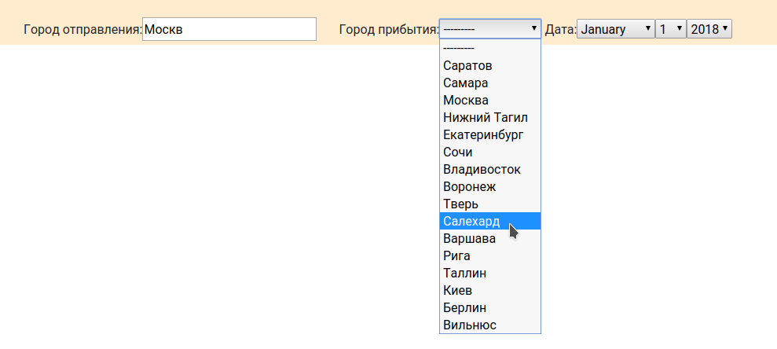
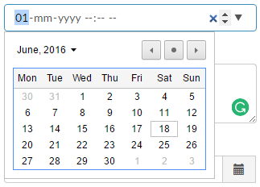

# Покупка авиабилетов. Формы запросов (виджеты, кэширование)

## Задание

В данном примере страница поиска авиабилетов.
Может когда-нибудь это будет популярный сайт.

В ней должно быть три поля: город отправления, город назначения, дата.
Пользователи любят автозаполнение. Его сейчас можно встретить везде.
Мало кто захочет пролистывать длинные списки в поисках нужного названия.

Задача:
1) Добавить форме три поля (два поля выбора города и поле выбора даты)
2) Сделать у одного поля выбора автозаполнение. (для этого достаточно заменить виджет)




## Реализация

Для задания готов набор данных для тестов.
Данные можно загрузить коммандой: `python manage.py loaddata app.json`

Виджет с автозаполнением готов и находится в файле `app/widgets.py`
Он сделан на основе стандартного `TextInput`. Магия ООП.
Осталось только передать его параметром `widget=` его в нужно месте.

Виджет принимает в качестве обязательного параметра ссылку на `url`, который будет подсказывать нужные города.
Так же виджету можно передать CSS парметры через параметр `attrs`.
 `attrs` это словарь `тег`: `значение`.

```
attrs={'class': 'inline right-margin'}
```

Динамическая подгрузка городов может сильно нагружать базу данных.
Поэтому при реализации метода, отдающего список городов, стоит использовать кеширование.
В Django есть интерфейс управления кешем. Базовые команды:

```
from django.core.cache import cache`

value = cache.get('key')
cache.set('key', value)
```


## Дополнительное задание (необязательное)

Если установка готового виджета показалась простой, то можете заменить стандартный виджет для даты.

Часто при разработке пользователи просят внести изменения в виджет.
Стандартные делаются не для красоты и удобства.
Делать свой виджет долго, быстрее использовать уже готовый.

Предлагается найти на просторах интернета виджет по-вашему усмотрению и добавить его в проект.


