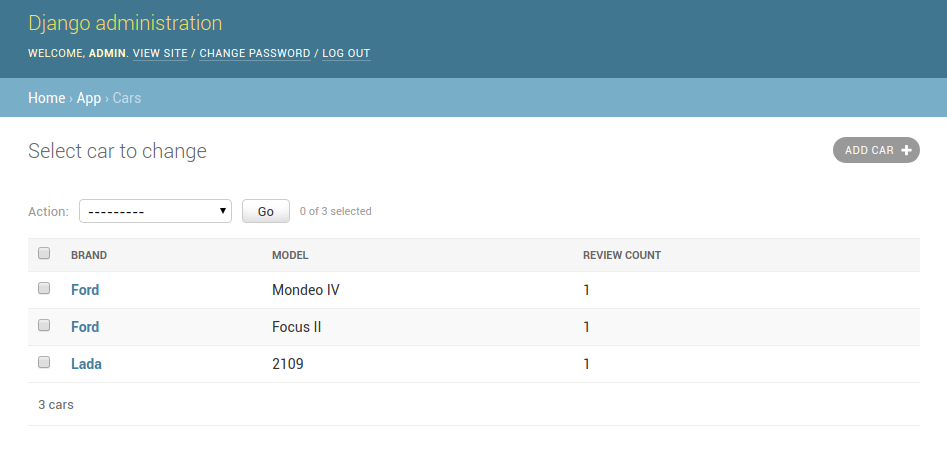
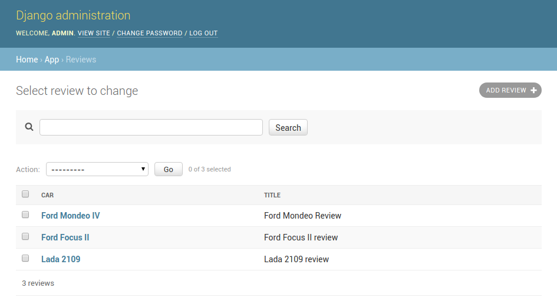
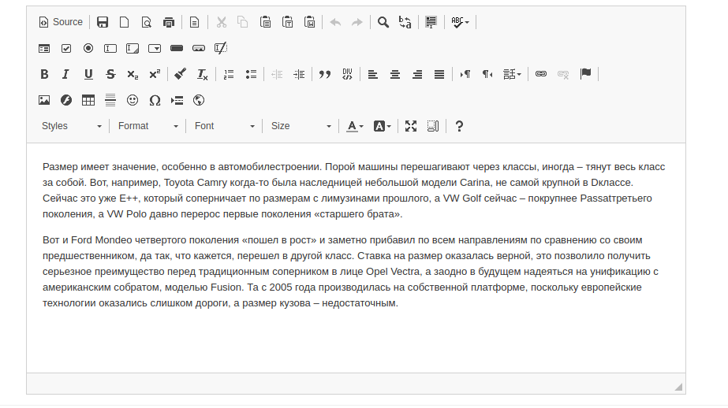

# Админка сайта обзора автомобилей

## Задание

Каждому динамическому сайту пользователи просят сделать админку.
Удобно редактировать модели, добавлять новые с помощью графического интерфейса.
Это позволяет не залезать в базу данных и не писать вручную sql-запросы.
Действия с объектами всегда одинаковые: создать, изменить, удалить.

Одна из сильных сторон Django - админка из коробки.
Её можно легко кастомизировать, просто отнаследовавшись от стандартной формы.

Есть две модели в БД: автомобиль (марка, модель), обзорная статья (автомобиль, заголовок статьи, текст обзора).
Нужно сделать админку:

1) С выводом в таблицу списка объектов.
2) Добавить поиск по названиям и заголовкам и фильтры по основным полям.
3) Для модели автомобиля добавить кастомное поля, в котором выводить количество статей про данный автомобиль.
4) Русифицировать отображение название моделей в админке (`car` -> `машина`).
5) Поменять порядок вывода объектов в списке (например от элемента с большим id к элементу с меньшим).
Тогда новые записи будут наверху.





## Реализация

В качестве виджета для редактирования текста в админке стоит CKEditor.
Для его установки требуется установить пакет для python `django-ckeditor`.
Затем требуется загрузить нужные js и прочие файлы командой:
```
python manage.py collectstatic
```

Для задания готов небольшой список данных для тестов.
Их можно загрузить коммандой: 
```
python manage.py loaddata app.json
```

Как изменять админку можно [подсмотреть в документации](https://docs.djangoproject.com/en/2.1/ref/contrib/admin/).

Так же удобно смотреть какие поля есть в оригинальной модели `admin.ModelAdmin` в PyCharm.
Достаточно кликнуть ctrl + левая кнопка мыши на название модели и мы увидим исходный код Django.
Там тот же python. Только мы не можем его менять, так это сторонняя библиотека и при переустановке изменения потеряются.


## Дополнительное задание (необязательное)

Часто пользователям не хватает стандартного виджета редактирования текста:
в нём приходится вводить html-теги вручную.
Тут на помощь приходит CKEditor.
https://github.com/django-ckeditor/django-ckeditor

Кроме установки, просят еще добавить новые кнопки на панель инструментов.
Настройки задаются в файле `settings.py`.

Предлагаю самостоятельно разобраться с настройкой и вывести кнопки на панель CKEditor.


