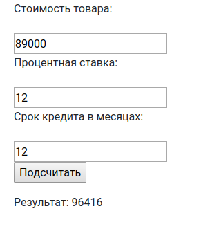

# Кредитный калькулятор. Формы (взаимодействие с сайтом)

## Задание

Сделать форму расчета стоимости товара в месяц и добавить проверку вводимых данных.

Форма состоит из трех полей:
1) Стоимость товара
2) Процентная ставка кредита
3) Срок в месяцах

Например, проценты и количество месяцев не могут быть отрицательными.

## Реализация

Сама функция подсчета сейчас не важна.
Воспользуемся простой формулой:
`Х = (стоимость + стоимость * процентную ставку) / срок в месяцах`.

Для отображения страницы с калькулятором достаточно использовать функцию `calc_view`.

В функции проверяем данные формы, пришедшие от пользователя.
Для этого передаем их в конструктор `CalcForm(request.GET)` и сохраняем в переменную.
Затем проверяем валидность вызовом функции `is_valid()` формы.

Форма уже есть `app/forms.py`, но валидация сделана не до конца.
Так же надо проверить правильные ли поля сейчас заданы в форме. Если ожидаются только цифры, то `forms.CharField` излишен.

### Как это может выглядеть

## Дополнительное задание (необязательное)

Можно попробовать решить задачу без формы.
То есть сверстать шаблон самостоятельно, вынести логику из формы во `view`.
Заодно будет видно меняют ли формы жизнь к лучшему.
Какой способ удобнее, если таких страниц будет несколько?
