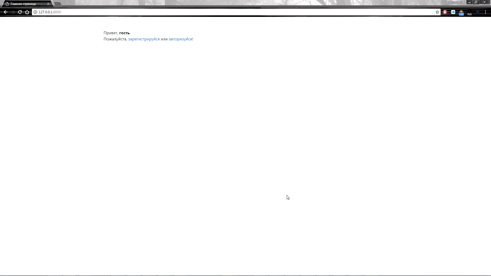
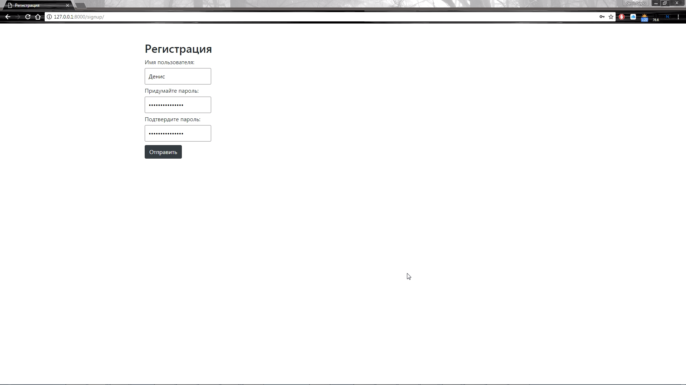
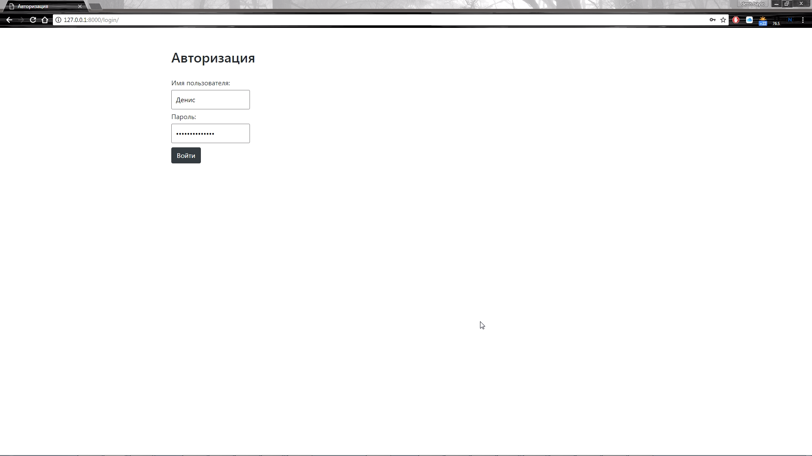
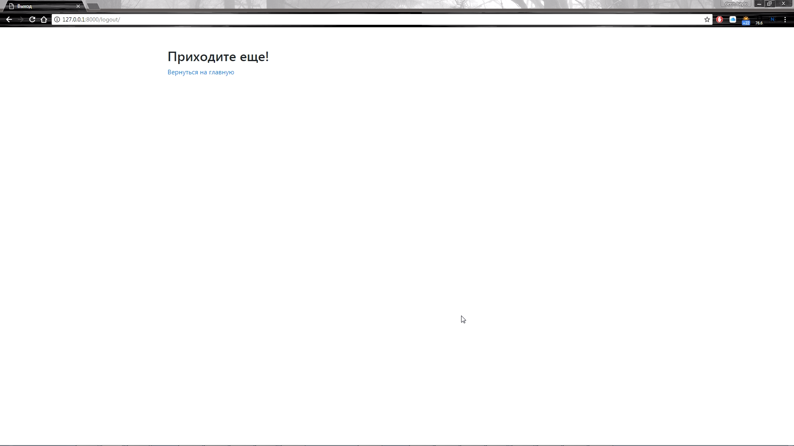

# Добавление возможности авторизации и регистрации пользователей на сайте

## Задание

Необходимо добавить возможность регистрирования пользователей на сайте. 
Так же любой зарегистрированный пользователь должен иметь возможность аутентифицироваться и выйти из свой учетной записи.

## Реализация

Для этого нам необходимо в файле `urls.py` добавить три пути: `login/` `logout/` `signup/`.
* при запросе `<имя_сайта>/login/` - должна открыться страница с формой для авторизации с двумя полями (логин и пароль)
* при запросе `<имя_сайта>/logout/` - должна открыться страница, с текстом "Спасибо, что посетили наш сайт, приходите еще!" 
и ссылкой на главную страницу
* при запросе `<имя_сайта>/signup/` - должна открыться страница с формой для регистрации с тремя полями (логин, пароль
и подтверждение пароля)

На главной странице необходимо написать приветственное письмо пользователю, если
* пользователь неавторизован, написать "Привет, гость! Пожалуйста зарегистрируйся или авторизуйся!". 
Слова "зарегистрируйся" и "авторизуйся" должны являться ссылками на страницы регистрации и авторизации соответственно.
* пользователь авторизолван, написать "Привет %username%!". Также в этом случае на странице должны быть три кнопки:
 * Зарегистрировать нового пользователя (signup)
 * Авторизоваться под другим пользователем (login)
 * Выйти (logout)

Рализовать авторизацию пользователей нужно с помощью `django.contrib.auth.views`,
а регистрацию с помощью `django.contrib.auth.forms.UserCreationForm`.

## Документация по проекту

Для запуска проекта необходимо:

Установить зависимости:
```bash
pip install -r requirements.txt
```

Выполнить следующие команды:

* Команда для создания миграций приложения для базы данных
```bash
python manage.py migrate
```

* Команда для запуска приложения
```bash
python manage.py runserver
```

* При создании моделей или их изменении необходимо выполнить следующие команды:
```bash
python manage.py makemigrations
python manage.py migrate
```








