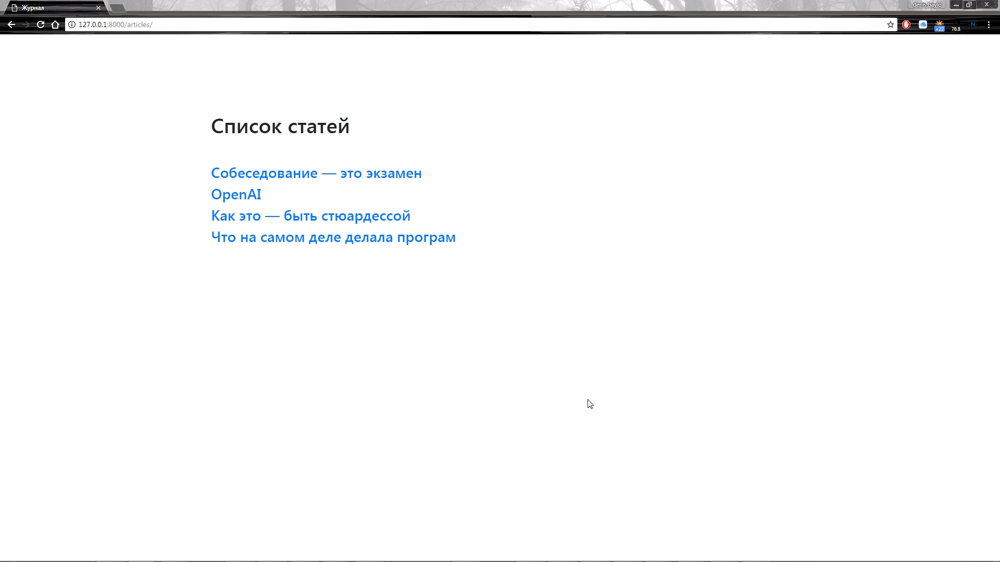
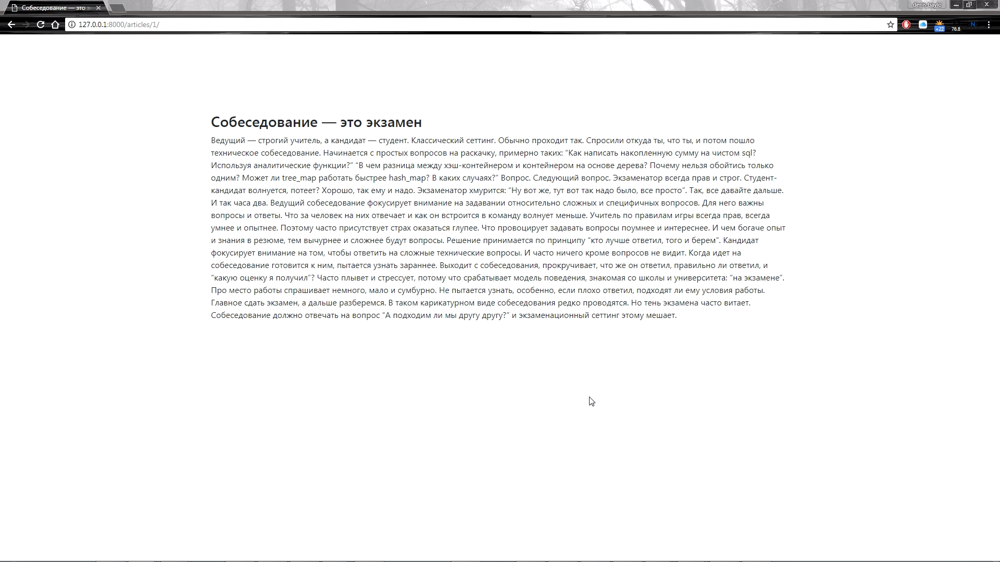
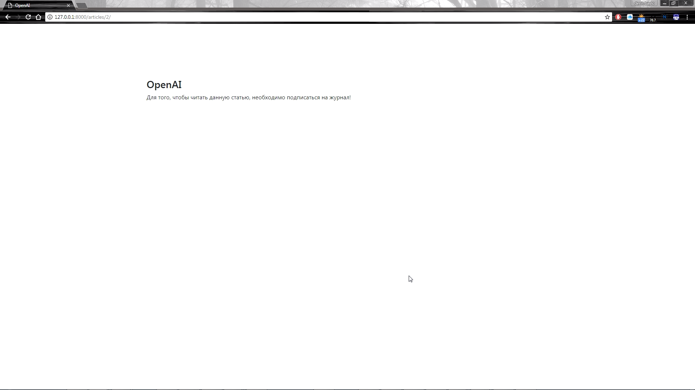

# Делаем платную подписку на журнал

## Задание

Делаем сайт с различными интересными и не очень статьями. Зайдя на сайт, пользователь должен увидеть список статей.
При нажатии на заголовок любой из них, он должен попасть на страницу с самой статьей, которая содержит в себе:
* заголовок статьи
* тематическое изображение статьи
* собственно текст статьи

После того как все это сделали, мы поняли, что на одной рекламе много не заработаешь и решили ввести на сайт платный контент.
А именно, особо интересные авторские статьи станут отображаться только у тех пользователей, который оформили платную подписку на журнал.


## Реализация

Необходимо переопределить модель пользователя, добавив в нее информацию о том, подписан ли этот пользователь на журнал или нет.
Добавить к модели статей поле, содержащее информацию о том, является ли данная статья платным материалом или же она в открытом доступе.
Ограничивать доступ пользователей, не оплатившим подписку к платному контенту.
Плюсом будет сделать отдельную страницу для оплаты, которая будет содержать кнопку "подписаться", при нажатии на которую, пользователь
получает доступ к платным статьями. Либо же можно манипулировать возможностью доступа пользователя через административную часть сайта.

## Документация по проекту

Для запуска проекта необходимо:

Установить зависимости:
```bash
pip install -r requirements.txt
```

Выполнить следующие команды:

* Команда для создания миграций приложения для базы данных
```bash
python manage.py migrate
```

* Команда для запуска приложения
```bash
python manage.py runserver
```

* При создании моделей или их изменении необходимо выполнить следующие команды:
```bash
python manage.py makemigrations
python manage.py migrate
```





